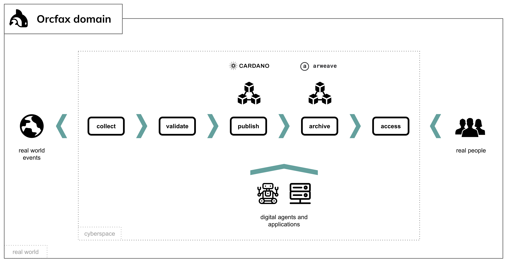

# Glossary

This repository contains terms and definitions for the entities and concepts in the Orcfax domain.

Orcfax is an oracle software system that publishes data about real-world events to the Cardano blockchain network.

--------
